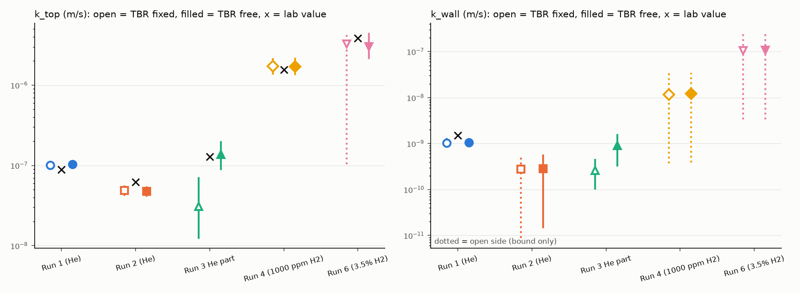
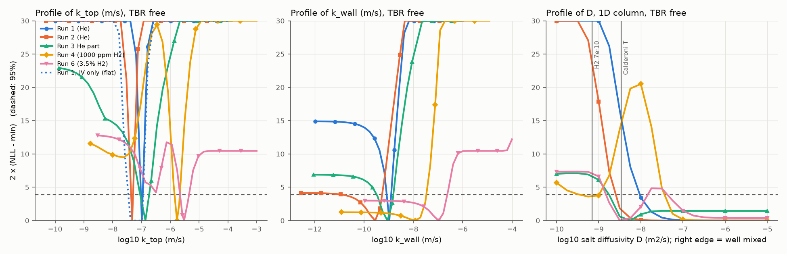

<!-- GENERATED FILE. Built by make_readme.py. Do not edit by hand. -->

# Appendix: fits, controls and reproduction

README.md has the two main results. This file has everything behind them and the rest of the identifiability study: which release-model parameters the BABY-1L data can pin down.

## Answers, parameter by parameter

1. **The total release rate is identifiable. The split between top and wall is not, from the inner vessel alone.** The inner-vessel (IV) curve pins alpha = (A_top k_top + A_wall k_wall)/V, the release time constant, in Run 1, Run 2, Run 3 (He part), Run 4 (1000 ppm part) and Run 6 (IV + OV, TBR free). Run 1: tau = 7.10 (6.53 to 7.73) days, 95% profile interval. With IV data only and TBR free, k_top gets only an upper bound: the value it takes if all loss goes through the top (1.15e-7 m/s in run 1). Below that the profile is flat, and its lower edge is wherever the allowed TBR range ends (2.87e-8 m/s for a factor of 3.16, 9.08e-9 m/s for a factor of 10). That holds with TBR free. With TBR fixed, the IV total itself sets the top share, so the split then rests on the TBR assumption. Adding the OV stream gives k_top a two-sided interval in every window (condition number of the physics block 13 to 222 in runs 1 to 4, against 1.6e10 to infinite with IV only).
2. **k_top gets a two-sided interval only when the outer-vessel (OV) stream is fitted too, and the test of that part of the model is weak.** The OV total sets the wall share. On counting noise alone, OV tritium looks late (still arriving after the IV has stopped) in Run 1, Run 2 and Run 4 (1000 ppm part). But counting noise alone does not describe these data (answer 7). Once each window's fitted scatter floors are added, Run 1 still shows a late OV, with the OV floor at its lower bound in Run 1. Run 2 and Run 4 (1000 ppm part) are untestable. Run 3 (He part) is consistent. So a late OV, which the 0D model cannot produce, is suggested but not established. The test does not apply to run 6 (its k_top steps). k_wall has a two-sided interval in Run 1, Run 2 and Run 3 (He part). Read k_wall as an OV amplitude, not a wall property.
3. **Run 2 released about half as fast as run 1, as the paper reports.** The paper links run 2's slower release to a heater malfunction that froze the salt mid-run (arXiv 2509.26174, sec. 3.3). The fits put run 2's k_top at 0.46 times run 1's (95%: 0.40 to 0.54, TBR free). The run-2 script sets 0.70. README.md (a note on run 2) and Run 2 below look at a change in rate during the run. A shared k_top for runs 1, 2 and 3 (He part) is rejected: likelihood ratio 40.8, bootstrap p = 0.002 (the smallest possible with 500 replicates, whose largest null LR was 14.3), asymptotic p = 1e-09. Runs 1 and 3 (He part) agree on the lab's numbers (ratio 1.33, 95%: 0.90 to 1.98, LR 2.1, p = 0.27).
4. **The H2 effect the paper reports (sec. 3.4) shows up the same way.** The `processed_data.json` values already put run 4 (1000 ppm H2) at 17.4 times run 1. The fits give 17 times (95%: 13 to 21), so this adds an interval and nothing else. There is one run per H2 condition, and gas is confounded with run order, irradiation schedule and a 7 C difference in logged salt temperature. Run 6 has 9 data points for 6 free parameters (k_top before and after its switch, k_wall, TBR scale and two scatter floors), so its fitted values are not used as results. A shared k_top for runs 4 and 6 gives LR 7.1, bootstrap p = 0.068 (500 replicates), so the two H2 runs are not told apart at this bootstrap size.
5. **At the lab's own production assumption, run 3's fit agrees with `processed_data.json`.** For run 3 the lab's model uses the modelled TBR (2.08e-03), not the measured 4.03e-03, which the paper puts down to extra release (sec. 3.2 and 3.4). At that TBR the He part gives k_top = 1.42e-7 m/s (95%: 9.63e-8 to 1.96e-7), and the `processed_data.json` value 1.29e-7 costs 2ΔNLL 0.4. Letting TBR float lands at 0.54 of the measured value (95%: 0.44 to 0.65), a TBR of 2.18e-03, within 5% of the modelled one. Fixing TBR at the measured value instead would give k_top = 3.07e-8 m/s, 4.5 times lower than the free fit, which is why the lab's choice matters for this run.
6. **These curves do not measure the salt diffusivity.** The 1D column used here puts all of the wall loss on its bottom face, uses the 1 L model height, and has low power: on run 1's design, synthetic data made at the Calderoni value were told apart from a well-mixed salt in 53% of 100 replicates. No window pins D unless TBR is fixed (run 3's He part), and that interval comes from the TBR assumption. Nothing here tests the paper's Sherwood analysis (sec. 3.3) or its diffusion-limited reading. The per-window profiles are under Salt diffusivity.
7. **Counting noise is not what limits these fits. Model error is.** With LSC counting noise alone, chi2 per degree of freedom runs from 7 to 625. Every interval here includes a fitted per-stream scatter floor on top of counting noise. In synthetic tests (1000 replicates per window and TBR mode) the nominal 95% intervals covered 87% to 94% of the time for k_top, 91.5% pooled (binomial SE 0.2 points), so read them as roughly 91% intervals.

Every number above comes from the scripts in this folder, listed at the end.

## Fitted values per run window

IV + OV fitted, TBR free as a nuisance scale. 95% profile-likelihood intervals. "open" means the data bound that side only up to a physical or prior limit. The lab's values are from each run's `processed_data.json` at the pinned ref. Run 6 is shown for completeness only (answer 4).

| Window | Gas | tau (d) | k_top (m/s) | lab k_top | k_wall (m/s) | lab k_wall | TBR / measured | IV floor (Bq) | OV floor (Bq) |
| --- | --- | --- | --- | --- | --- | --- | --- | --- | --- |
| Run 1 | He | 7.10 (6.53 to 7.73) | 1.03e-7 (9.44e-8 to 1.12e-7) | 8.90e-8 | 1.06e-9 (8.68e-10 to 1.26e-9) | 1.51e-9 | 0.98 (0.93 to 1.03) | 0.13 | 0.00 (at bound) |
| Run 2 | He | 15.54 (13.80 to 17.61) | 4.76e-8 (4.19e-8 to 5.36e-8) | 6.23e-8 | 2.83e-10 (1.50e-11 to 5.51e-10) | 0 | 1.04 (0.95 to 1.13) | 1.12 | 0.42 |
| Run 3 (He part) | He | 5.38 (3.81 to 8.22) | 1.37e-7 (8.95e-8 to 1.94e-7) | 1.29e-7 | 8.94e-10 (3.35e-10 to 1.54e-9) | 0 | 0.54 (0.44 to 0.65) | 0.47 | 0.00 (at bound) |
| Run 4 (1000 ppm part) | 1000 ppm H2 in He | 0.43 (0.34 to 0.54) | 1.71e-6 (1.37e-6 to 2.15e-6) | 1.55e-6 | 1.22e-8 (below 3.45e-8) | 0 | 1.01 (0.87 to 1.16) | 0.81 | 0.23 |
| Run 6 | 3.5% H2, then He | 0.23 (0.15 to 0.31) | 3.02e-6 (2.18e-6 to 4.39e-6) | 3.87e-6 | 1.07e-7 (below 2.40e-7) | 0 | 1.09 (0.85 to 1.33) | 1.02 | 0.82 |

"(at bound)": the fitted floor sits on its lower limit, 1e-04 Bq, so it is effectively zero. That happens for the OV floor in Run 1 and Run 3 (He part) (TBR free). Controls below test whether that collapse is real.

With TBR fixed at the value the lab's model uses (`TBR_used_in_model`: measured for runs 1, 2, 4 and 6, modelled for run 3), and 2ΔNLL at the lab's k_top with k_wall re-fitted:

| Window | tau (d) | k_top (m/s) | k_wall (m/s) | 2ΔNLL at lab k_top | lab-style cumulative fit k_top |
| --- | --- | --- | --- | --- | --- |
| Run 1 | 7.21 (6.67 to 7.82) | 1.01e-7 (9.33e-8 to 1.10e-7) | 1.04e-9 (8.57e-10 to 1.25e-9) | 7.6 | 9.64e-8 |
| Run 2 | 15.21 (13.59 to 17.18) | 4.86e-8 (4.30e-8 to 5.45e-8) | 2.78e-10 (below 5.49e-10) | 13.7 | 5.06e-8 |
| Run 3 (He part) | 5.19 (3.78 to 7.64) | 1.42e-7 (9.63e-8 to 1.96e-7) | 9.24e-10 (3.21e-10 to 1.57e-9) | 0.4 | 1.61e-7 |
| Run 4 (1000 ppm part) | 0.43 (0.35 to 0.53) | 1.72e-6 (1.40e-6 to 2.12e-6) | 1.17e-8 (below 3.43e-8) | 1.1 | 1.69e-6 |
| Run 6 | 0.21 (upper bound only) | 3.26e-6 (below 4.45e-6) | 1.05e-7 (below 2.53e-7) | 1.5 | 3.84e-6 |

The lab-style column is an unweighted least-squares fit to the cumulative IV and OV curves at the lab's TBR, with no noise model, as a check that the comparison does not hinge on the noise model.

With TBR fixed at the lab's measured value instead:

| Window | tau (d) | k_top (m/s) | k_wall (m/s) |
| --- | --- | --- | --- |
| Run 1 | 7.21 (6.67 to 7.82) | 1.01e-7 (9.33e-8 to 1.10e-7) | 1.04e-9 (8.57e-10 to 1.25e-9) |
| Run 2 | 15.21 (13.59 to 17.18) | 4.86e-8 (4.30e-8 to 5.45e-8) | 2.78e-10 (below 5.49e-10) |
| Run 3 (He part) | 23.92 (10.70 to 57.62) | 3.07e-8 (1.25e-8 to 6.92e-8) | 2.59e-10 (1.04e-10 to 4.47e-10) |
| Run 4 (1000 ppm part) | 0.43 (0.35 to 0.53) | 1.72e-6 (1.40e-6 to 2.12e-6) | 1.17e-8 (below 3.43e-8) |
| Run 6 | 0.21 (upper bound only) | 3.26e-6 (below 4.45e-6) | 1.05e-7 (below 2.53e-7) |


Runs 3 and 4 with the run-6 background (README section 1), at the lab's TBR and with TBR free, and 2ΔNLL at the lab's k_top:

| Window | TBR | k_top (m/s) | k_wall (m/s) | 2ΔNLL at lab k_top |
| --- | --- | --- | --- | --- |
| Run 3 (He part) | lab | 1.40e-7 (8.32e-8 to 2.01e-7) | 1.66e-9 (2.93e-10 to 3.03e-9) | 0.2 |
| Run 3 (He part) | free | 1.28e-7 (7.20e-8 to 1.87e-7) | 1.51e-9 (4.71e-10 to 2.75e-9) | 0.0 |
| Run 4 (1000 ppm part) | lab | 1.72e-6 (1.37e-6 to 2.13e-6) | 1.35e-8 (below 4.01e-8) | 0.9 |
| Run 4 (1000 ppm part) | free | 1.69e-6 (1.34e-6 to 2.15e-6) | 1.44e-8 (below 4.05e-8) | 0.6 |

Run 6's k_top after its switch to He: not identifiable. Only one IV sample falls after the switch. Run 6's measured TBR carries tritium that left before the switch, so the He value cannot be tested against runs 1 to 3.

Run 3 (whole run) with one k_top per gas: k_top before the switch is upper bound only, after the switch not identifiable. The scatter floor rises to 0.88 Bq (IV) and 0.40 Bq (OV). A single salt reservoir cannot produce the late releases after the gas switch.
Run 4 (whole run) with one k_top per gas: k_top before the switch is identifiable, after the switch not identifiable. The scatter floor rises to 1.32 Bq (IV) and 1.53 Bq (OV). A single salt reservoir cannot produce the late releases after the gas switch.



## Identifiability, parameter by parameter

Status from the profile likelihood (95%). Edges are found by root-finding, not grid interpolation. A side is open when the TBR scale is held at its allowed range there (factor 3.16, a prior, so no information from the data), or when the profile dips back below the 95% line further out. The physical limit k_wall = 0 does count: an upper bound on k_top from "all loss through the top" is real information.

| Window | Data used | k_top | k_wall | alpha (total rate) | TBR scale |
| --- | --- | --- | --- | --- | --- |
| Run 1 | IV+OV, TBR fixed | identifiable | identifiable | identifiable | fixed |
| Run 1 | IV+OV, TBR free | identifiable | identifiable | identifiable | identifiable |
| Run 1 | IV only, TBR free | upper bound only | not identifiable | identifiable | lower bound only |
| Run 2 | IV+OV, TBR fixed | identifiable | upper bound only | identifiable | fixed |
| Run 2 | IV+OV, TBR free | identifiable | identifiable | identifiable | identifiable |
| Run 2 | IV only, TBR free | upper bound only | not identifiable | identifiable | lower bound only |
| Run 3 (He part) | IV+OV, TBR fixed | identifiable | identifiable | identifiable | fixed |
| Run 3 (He part) | IV+OV, TBR free | identifiable | identifiable | identifiable | identifiable |
| Run 3 (He part) | IV only, TBR free | upper bound only | not identifiable | identifiable | lower bound only |
| Run 4 (1000 ppm part) | IV+OV, TBR fixed | identifiable | upper bound only | identifiable | fixed |
| Run 4 (1000 ppm part) | IV+OV, TBR free | identifiable | upper bound only | identifiable | identifiable |
| Run 4 (1000 ppm part) | IV only, TBR free | upper bound only | not identifiable | identifiable | lower bound only |
| Run 6 | IV+OV, TBR fixed | upper bound only | upper bound only | upper bound only | fixed |
| Run 6 | IV+OV, TBR free | identifiable | upper bound only | identifiable | identifiable |
| Run 6 | IV only, TBR free | upper bound only | not identifiable | upper bound only | lower bound only |

Fisher information against the profiles: where k_top is identifiable, the Wald 95% half-width is 0.82 to 0.93 times the profile half-width. Fisher is a fair shortcut there. It is not one for k_wall, whose profiles are lopsided. The Fisher matrix does flag the flat direction. Its condition number for (k_top, k_wall, TBR) is 2e+10 to inf with IV only, against 13 to 222 with IV + OV (runs 1 to 4).



## Transferability tests

Likelihood ratio (LR) of "one shared value" against "one value per run". Every other parameter, including TBR scale and scatter floors, stays per run. The p-value comes from a parametric bootstrap under the shared-value fit (500 replicates, so the smallest reportable p is 0.002). Power is the rejection rate when the second run's value is really 1.5 or 2 times the first.

| Runs | Shared | LR | p (bootstrap) | p (chi2) | null LR median / 95% / max | power x1.5 | power x2 | usable |
| --- | --- | --- | --- | --- | --- | --- | --- | --- |
| Run 1, Run 2, Run 3 (He part) | ktop | 40.8 | 0.002 | 1.4e-09 | 1.7 / 7.2 / 14.3 | 34% | 78% | yes |
| Run 1, Run 2 | ktop | 32.7 | 0.002 | 1.1e-08 | 0.7 / 5.2 / 12.8 | 33% | 72% | yes |
| Run 1, Run 3 (He part) | ktop | 2.1 | 0.265 | 1.5e-01 | 0.7 / 6.5 / 14.0 | 48% | 91% | yes |
| Run 1, Run 2, Run 3 (He part) | kwall | 12.1 | 0.006 | 2.3e-03 | 1.5 / 6.5 / 16.6 | 20% | 56% | yes |
| Run 4 (1000 ppm part), Run 6 | ktop | 7.1 | 0.068 | 7.6e-03 | 1.0 / 7.9 / 17.2 | 21% | 50% | yes |

A test is marked not usable when half or more of its null replicates give an LR near zero. The fits then sit on a flat or bounded direction, and the bootstrap cannot calibrate the statistic. No test here is in that state. Real and bootstrap LRs use the same optimiser as the real fits (the 8-point start grid plus Powell polish). The separate fits inside each test reproduce the stored per-run fits, which the README build checks. Power uses 250 replicates per factor (binomial SE up to 3 points). The run 1 against run 3 test has 91% power at a factor of 2 and finds no difference. But run 3's value moves by more than that factor with the TBR assumption (answer 5).

## Is the OV stream consistent with the 0D model?

With constant k_top and k_wall, IV and OV are both integrals of the same salt concentration, so OV(t)/IV(t) is constant. Test at a common time t*: the first OV sample time (other than the last) by which the IV has collected 80% of its total. Compared: each stream's share collected after t*. 95% intervals two ways: counting noise only, and counting noise plus the window's fitted per-stream scatter floors (TBR free fit). The fits need those floors, so the floor-included verdict is the one concluded from. "Untestable" means the interval is wider than 1 or reaches outside [-1, 1], the range a share difference can take.

| Window | Data | t* (day) | IV share after | OV share after | OV minus IV | 95%, counting only | Verdict, counting only | 95%, with floors | Verdict, with floors |
| --- | --- | --- | --- | --- | --- | --- | --- | --- | --- |
| Run 1 | as published | 14.1 | 16% | 53% | +0.37 | +0.07 to +0.53 | OV late | +0.07 to +0.54 | OV late |
| Run 2 | as published | 35.1 | 6% | 26% | +0.20 | +0.11 to +0.28 | OV late | -1.14 to +0.98 | untestable |
| Run 3 (He part) | as published | 14.0 | 7% | 19% | +0.11 | -0.31 to +0.47 | consistent | -0.31 to +0.48 | consistent |
| Run 3 (He part) | run-6 background | 14.0 | 8% | 24% | +0.17 | +0.03 to +0.31 | OV late | -0.09 to +0.43 | consistent |
| Run 4 (1000 ppm part) | as published | 6.0 | 20% | 64% | +0.45 | +0.35 to +0.57 | OV late | +0.10 to +1.12 | untestable |
| Run 4 (1000 ppm part) | run-6 background | 7.0 | 13% | 57% | +0.44 | +0.36 to +0.53 | OV late | +0.11 to +1.08 | untestable |
| Run 6 | as published | | | | | | | | not applicable: k_top steps inside this window, so OV/IV need not be constant |

A delayed OV is what permeation through the crucible wall or holdup in the outer vessel would look like. The 0D model has neither. With floors included it shows in Run 1, a lead, not a finding, given the collapsed OV floor there.

## Chemical form by stream

Share of each stream's whole-run total that was water soluble in the LSC split (roughly HTO/TF, against HT after the furnace). The 0D model ignores this.

| Run | Gas | IV soluble share | OV soluble share | IV / OV soluble share, run-6 background |
| --- | --- | --- | --- | --- |
| 1 | He | 3% | 52% | not corrected (other quench set) |
| 2 | He | 1% | 66% | not corrected (other quench set) |
| 3 | He, then 1000 ppm H2 bal. He | 5% | 17% | 8% / 32% |
| 4 | 1000 ppm H2 bal. He, then 3.5% H2 bal. He | 1% | 1% | 2% / 6% |
| 6 | 3.5% H2 bal. He, then He | 1% | 2% | same (the lab's own curve) |

## Run-6 background: method and checks

`quench.py` executes each run's `tritium_model.py` unchanged and takes `background_curve` from run 6's own namespace (`build_background_curve_from_file`, a linear interpolation of the 7 blanks in `SLR_BLANK_SCAN.csv`, 2 to 11 mL water, quench set 3H-UG-LLT-NM-C). For a vial at tSIE t counted in a file whose blank sits at tSIE t_b and reads B, the background is B x curve(t) / curve(t_b): the scan's shape, the level of the blank counted with that vial. "As written" is curve(t) alone, as run 6 does it. Both keep the toolbox's clamp of negative net vials to zero. After the correction few vials go negative, so the clamp barely matters (run 3 IV + OV 33.10 Bq clamped, 33.04 not, every vial corrected with the curve as interpolated).

Checks, and what they do and do not show. (1) For every run, `quench.py` recomputes the lab's published net activity of every vial from the gross count and the background the lab subtracted, to 1e-9 Bq, and its per-sample totals equal `increments.json`, which `build_increments.py` matches to each `processed_data.json` to 1e-9 Bq. Those are the real validations. (2) The curve read from the scan file equals the lab's own `background_curve` object to 1e-12 Bq. (3) On run 6, subtracting that curve reproduces the published nets exactly. That last check is close to tautological, because run 6's published nets are that same curve subtracted. It confirms the plumbing, not the method.

The curve between the blanks (tSIE 280 to 292) and ordinary vials (median 293 in run 3) rests on the scan's two lowest points. How much each curve shape adds, split by where it comes from:

| Run | Curve below tSIE 300 | Added, vials above tSIE 330 (Bq) | Added, all vials (Bq) | Negative vials, all corrected | Mean net, low-activity vials above tSIE 330 (Bq) |
| --- | --- | --- | --- | --- | --- |
| 3 | held flat below tSIE 300 | +0.79 | +0.85 | 23 | +0.036 |
| 3 | straight-line fit | +0.80 | +1.35 | 22 | +0.033 |
| 3 | quadratic fit | +1.27 | +2.51 | 10 | +0.047 |
| 3 | as interpolated (run 6) | +1.32 | +3.45 | 5 | +0.059 |
| 4 | held flat below tSIE 300 | +0.36 | +0.45 | 33 | +0.026 |
| 4 | straight-line fit | +0.19 | +0.46 | 31 | +0.013 |
| 4 | quadratic fit | +0.54 | +1.16 | 17 | +0.040 |
| 4 | as interpolated (run 6) | +0.51 | +1.41 | 18 | +0.037 |

| Run | Quench set | Vials above tSIE 330 | Blank minus curve (Bq, median) | Negative vials, published / run-6 | Mean net, low-activity vials above / below tSIE 330, published (Bq) | same, run-6 background (Bq) | Measured TBR, curve as written |
| --- | --- | --- | --- | --- | --- | --- | --- |
| 1 | 3H-UG-LLT-NM | 11 of 60 | +0.081 | 14 / - | -0.034 / +0.039 | - | - |
| 2 | 3H-UG-LLT-NM | 13 of 80 | +0.118 | 25 / - | -0.027 / +0.036 | - | - |
| 3 | 3H-UG-LLT-NM-C | 26 of 120 | +0.028 | 39 / 5 | -0.046 / +0.076 | +0.059 / +0.103 | 4.88e-03 |
| 4 | 3H-UG-LLT-NM-C | 15 of 144 | +0.008 | 43 / 18 | -0.030 / +0.050 | +0.037 / +0.061 | 2.65e-03 |
| 6 | 3H-UG-LLT-NM-C | 2 of 36 |  | 4 / - | +0.018 / +0.057 | - | - |

Low-activity means gross below 0.6 Bq. Those vials still carry real tritium, so their mean need not be zero, but it cannot be negative. The first bubbler vial is the one whose water evaporates between samples (run 2's `general.json`: "Bubbler water in vials 2-X-1 replenished periodically to compensate for evaporation"). Less water means less quench and higher tSIE, which is what the blank scan varies. 2 run 3 vials lie beyond the scan's highest tSIE and use the linear extrapolation run 6 uses. Holding the curve flat there instead changes run 3's IV + OV total by -0.01 Bq. Measured TBR scales with IV + OV, as in each run's `tritium_model.py` (T_produced / T_consumed). The ± values do not include the change of the scan's level between its count and runs 3 and 4, which the "as written" column brackets.

## Run 2

One k_top for the whole run against one that changes at a sample time (lab TBR, k_wall and floors re-fitted). The change days were picked after looking at the data, so the best one is calibrated by simulation: 200 data sets from the one-k_top fit, each refitted at every change day, best gain kept. Their 95th percentile is 7.6.

| Change at day | 2ΔNLL gain | tau before (d) | tau after (d) | k_top after (m/s) | IV floor (Bq) |
| --- | --- | --- | --- | --- | --- |
| 9.2 | 5.8 | 16.2 | 13.5 | 5.47e-8 (4.79e-8 to 6.19e-8) | 0.94 |
| 13.1 | 46.0 | 15.8 | 11.1 | 6.70e-8 (6.42e-8 to 7.00e-8) | 0.23 |
| 17.0 | 7.2 | 15.2 | 11.5 | 6.43e-8 (5.23e-8 to 7.83e-8) | 0.89 |
| 22.2 | 0.4 | 15.1 | 13.4 | 5.52e-8 (3.37e-8 to 8.10e-8) | 1.13 |
| 27.1 | 0.5 | 15.4 | 19.8 | 3.73e-8 (1.17e-8 to 7.24e-8) | 1.14 |

One k_top: 4.86e-8 m/s, IV floor 1.15 Bq. The gain peaks sharply at one sample, so the change is located to within one sampling interval, not dated. The paper's freeze is not in the run's files. Ratios in README.md use run 1's lab-TBR fit (1.01e-7 m/s) or the run-1 script value (8.90e-8 m/s).

## Salt diffusivity

1D salt column (`fv1d.py`), height 6.50 cm, Robin release at the top, wall loss on the bottom face, exact in time. D fixed on a grid from 1e-10 to 1e-5 m2/s, all else refit. The right end of each curve is the well-mixed 0D model. Checks: the solver matches the 0D model at large D to 3e-06. It matches FESTIM (a 1D FESTIM model with a Robin top, 50 cells, not included in the share bundle) to 0.23% at D = 7.0e-10 and 0.17% at D = 3.4e-9 m2/s. At those two D values a stagnant salt changes the run 1 curve by 125% and 39% against the well-mixed model, so the test has something to see. Grid: 60 against 240 cells differ by 0.13% at 7e-10 m2/s.

Column height caveat: the column here is the lab's 1 L model (6.50 cm). The logged salt charge (1.88 kg at 1.5398 g/cm3) fills about 7.96 cm. Diffusive times scale with height squared, so every D threshold in this section would move up by a factor of about 1.50 with the logged charge (see Data and noise model).

Reference values: Calderoni's T in FLiBe, D = 9.3e-7 exp(-42 kJ/mol / RT) at each run's logged salt temperature, and 7e-10 m2/s for H2 near 900 K. Both are FLiBe numbers. We found no measured value for ClLiF.

| Window | TBR | 95% region for D (m2/s) | 2dNLL at Calderoni | 2dNLL at 7e-10 | 2dNLL well mixed |
| --- | --- | --- | --- | --- | --- |
| Run 1 | free | above 9.5e-9 | 15.4 | 36.8 | 0.0 |
| Run 2 | free | above 2.6e-9 | 1.6 | 23.6 | 0.0 |
| Run 3 (He part) | free | above 1.8e-9 | 0.5 | 6.6 | 1.4 |
| Run 4 (1000 ppm part) | free | above 3.8e-10, plus isolated grid points at log10 D = -9.25, -9.0 | 15.0 | 3.7 | 0.0 |
| Run 6 | free | above 1.5e-9, plus isolated grid points at log10 D = -7.25, -7.0, -6.75, -6.5, -6.25, -6.0, -5.75, -5.5, -5.25, -5.0 | 0.1 | 7.0 | 0.4 |
| Run 1 | fixed | above 8.7e-9 | 14.9 | 38.4 | 0.0 |
| Run 2 | fixed | above 2.7e-9 | 2.1 | 24.6 | 0.0 |
| Run 3 (He part) | fixed | 3.5e-10 to 1.7e-9 | 6.1 | 0.2 | 6.6 |
| Run 4 (1000 ppm part) | fixed | above 3.8e-8 | 9.6 | 6.3 | 0.0 |
| Run 6 | fixed | above 9.4e-9, plus isolated grid points at log10 D = -8.0 | 10.5 | 8.8 | 0.0 |

Run 4's isolated points near log10 D = -9.25 are degenerate fits. k_top sits at its upper limit (a perfectly absorbing top), TBR is 2.2 times the measured value, and the IV scatter floor grows to 2.7 Bq against 0.81 Bq well mixed. They vanish with TBR fixed.
Windows where the 95% set for D is closed on both sides: Run 3 (He part) with TBR fixed.
For run 3's He part that happens only with TBR fixed. The slow tail that a fixed TBR forces is being explained by slow diffusion. That is the TBR assumption talking, not a measurement of D.
The 1D rung puts all the wall loss on the bottom face. A real crucible loses through its side wall too, which a 2D model would carry. The minimum salt temperature is the lab's logged `temperature_salt`, which the lab notes is a minimum.

## Controls: does the method recover known truth?

Synthetic data use each window's real sampling times, irradiation schedule, counting covariance and fitted scatter floors, with the fitted parameters as truth. Fits start from a fixed grid, never from the truth.

- Synthetic fits use the same optimiser as the real fits: the 8-point start grid plus Powell polish.
- Coverage of nominal 95% profile intervals (1000 replicates per window and TBR mode, binomial SE about 0.7 points each): k_top 87% to 94% (91.5% pooled), k_wall 85% to 98%, alpha 87% to 94%. Intervals run narrow. With 9 to 26 points per window, maximum likelihood underestimates the scatter floors. Read the intervals as roughly 91%. Coverage is checked at the truth, so it does not test how the interval edges were located.
- OV floor collapse. With the collapsed OV floor as truth (as fitted), the refit OV floor lands on its bound in 73% to 86% of replicates for Run 1 TBR fixed, Run 1 TBR free, Run 3 (He part) TBR fixed, Run 3 (He part) TBR free. With a non-zero OV floor as truth instead (0.42 Bq, the median of the non-collapsed floors in Run 2, Run 4 (1000 ppm part) and Run 6), it collapses in 0% to 1%, and k_top coverage is 92% to 94% (1000 replicates each). So a collapse in the real fits is evidence that the OV scatter there really is small, not an optimiser artefact.
- Median error of fitted log10 k_top, runs 1 to 4: -0.005 to +0.003 decades. No material bias there.
- Run 6's first sample comes 6.2 hours after the start of a 1.0 hour irradiation, and its fitted release half-time is 3.8 hours, so its sampling barely resolves the rate. In 2% (TBR fixed) and 0% (TBR free) of synthetic replicates the fitted k_top was off by more than a decade. With the full optimiser that failure did not show up at this replicate count. An earlier two-start fit without polish did show it, which points to the optimiser rather than to run 6.
- Flat direction stays flat: IV-only fits of synthetic run 1 data gave k_top no lower limit from the data in 100% of 200 replicates. The same data with OV gave a two-sided interval in 100%.
- Transfer test, both sides: under a true shared k_top the bootstrap 95% LR for the three He runs is 7.2 (chi2 says 6.0). With run 2's k_top truly 2 times higher, it rejects in 78% of replicates.
- Diffusivity, both sides (run 1 design, 100 replicates per truth): with well-mixed truth the method returned a lower bound only in 94 of 100 and kept the truth inside 95% in 94%. With D = 7e-10 truth it kept the truth in 90% and rejected well mixed in 54%. With the Calderoni value at run 1's temperature as truth (3.4e-9 m2/s) it kept the truth in 90% and rejected well mixed in 53%. The diffusivity fits keep their own single optimiser setting (L-BFGS-B without polish) at every D, the well-mixed end included.

## Data and noise model

- Runs 1 to 4 at the tags `case.yaml` (bundle root) uses (v0.6, v0.5, v0.2, v0.1). Run 6 at commit `82c5af9` (no tag exists). The raw LSC exports were fetched by `fetch_lsc.py` and pinned by sha256 in `lsc_manifest.json`. The three non-LSC files per run match `upstream/MANIFEST.json` (bundle root).
- `build_increments.py` runs each lab's own `tritium_model.py` unchanged against those files, with the toolbox wrapped so every vial carries its Poisson error (Bq / sqrt(CPMA x count time)). Shared blanks give correlated errors. The rebuilt cumulative curves equal `processed_data.json` to 1e-9 Bq in every run and stream.
- The Poisson formula checks out on run 1's six-fold recounts: the scatter of 5 vials counted 6 times is 1.21 times the predicted sigma (25 dof).
- Fits use per-sample increments, not the cumulative curve, so errors do not pile up along the curve.
- Scatter floor: counting noise plus a fitted additive term per stream (Bq). Two alternatives were rejected. A term proportional to the data let run 4's fit ignore its big early samples (k_top fell to 2e-9 m/s). A term proportional to the model stuck in local minima.
- Background: the main fits use the lab's numbers (one blank per file, negative vials set to zero by the toolbox). The run-6 background variant for runs 3 and 4 is described above. It changes the per-sample increments. The counting covariance is kept from the published background, which slightly understates the blank's weight in the corrected vials.
- The 0D model and geometry are the lab's: radius 7 cm, V = 1 L, wall 0.06 in, decay on. The solver matches `release/r0.py` (bundle root) to 2e-15.
- Windows: run 3 is cut at its switch to H2 (day 18.21) and run 4 at its switch to 3.5% H2 (day 17.37). Run 6 is fitted whole, with k_top stepping at its switch to He.
- TBR range sensitivity: widening the allowed TBR range from a factor of 3.16 to 10 leaves the IV + OV k_top, k_wall and alpha estimates and intervals unchanged (within 0.01 in log10) in Run 1, Run 2, Run 3 (He part), Run 4 (1000 ppm part) and Run 6. See `freeTBR_wideTBR` in results.json. It also moves the prior-set lower edge of IV-only k_top.
- TBR as a nuisance: a scale on the lab's measured TBR, allowed within a factor of 3.16. Its 95% interval includes 1 in Run 1, Run 2, Run 4 (1000 ppm part) and Run 6 and excludes 1 in Run 3 (He part). Landing at 1 is expected, because the measured TBR is computed from these same collected totals. It is not independent evidence.
- Salt volume caveat. The models use the lab's 1 L column (6.50 cm at 7 cm radius). The logged charge is 1.88 kg, which at the lab's density of 1.5398 g/cm3 (650 C) is 1.221 L, a column about 7.96 cm tall (`case.yaml` best estimate, bundle root). The fits measure release rates per unit volume (alpha), so with the logged charge every absolute k_top here would be 22% higher (volume over top area, which does not change) and k_wall about 6% higher (the wall area grows with the column). Diffusivity thresholds scale with height squared, a factor of 1.50. Ratios between runs, alpha and tau, and every identifiability status are unaffected.
- `requirements.txt` pins `libra-toolbox` at `4c7ef88`: the repo's pinned `cb41e93` plus the merged PR #94, which only lets the package import without OpenMC. Nothing under `libra_toolbox/tritium/` differs.

## What this does not show

- It does not say which physics sets k_top. The 0D model lumps salt mixing, the gas-side film and surface kinetics into one number.
- The intervals are conditional on the model. The OV test shows the model is wrong for OV timing, so k_wall intervals mean little, and k_top intervals are best read as "what this model needs".
- Runs 7 to 10 and the FLiBe-1L runs are not used.

## Reproduce

From this folder, with Python 3.12 or later:

```bash
make venv             # .venv from requirements.txt (libra-toolbox pinned to 4c7ef88)
make data             # re-download the raw LSC files (sha256-pinned), rebuild increments.json and quench.json, check both are identical
make reproduce-fast   # every stage at low replicate counts, APPENDIX.md and README.md stamped DRAFT
make reproduce-full   # the replicate counts the claims need, hours of CPU, use a many-core machine
```

Measured times are in the `Makefile`. Both reproduce targets overwrite the committed results. Re-extracting the bundle restores them. The FESTIM cross-check needs the repository's FESTIM model, which is not in the bundle. Without it the check is skipped with a message and the committed `festim_check.json` is used.

The commands and replicate counts that produced the committed results, read from the provenance records:

```bash
python fetch_lsc.py  # raw LSC files, sha256-pinned
python build_increments.py
python quench.py
python analysis.py --part fits --workers 64  # 2026-10-07T04:05, 1.0 min, 64 cores, code 1a154ac
python analysis.py --part controls --reps 1000 --flat-reps 200 --workers 64  # 2026-10-07T04:51, 28.3 min, 64 cores, code 1a154ac
python analysis.py --part transfer --boot-reps 500 --power-reps 250 --workers 64  # 2026-10-07T05:19, 96.6 min, 64 cores, code 1a154ac
python change.py --reps 200  # 2.9 min
python festim_check.py  # optional, needs FESTIM and the repository's FESTIM model
python diffusivity.py --part windows --workers 32  # 2026-09-30T00:55, 1.4 min, 32 cores, code dfc5579
python diffusivity.py --part controls --workers 32 --control-reps 100  # 2026-09-30T00:57, 12.1 min, 32 cores, code dfc5579
python make_figures.py
python make_readme.py
```

`make_readme.py` refuses to build if any part is missing its provenance, was computed from a different `increments.json` or `quench.json`, if controls or transfer were computed from different fits than the ones stored, or if replicate counts are below what the claims need (unless `--draft`).

## Files

- `fetch_lsc.py`: download raw lab files at pinned refs
- `lsc_manifest.json`: sha256 pins for those files
- `build_increments.py`: run the lab's scripts, attach counting covariance
- `increments.json`: per-sample increments and covariance, runs 1-4 and 6
- `quench.py / quench.json / quench_variants.json`: the run-6 tSIE background applied to runs 3 and 4, curve-shape variants
- `model0d.py`: 0D model with an optional gas step
- `fitlib.py`: likelihood, fits, profiles, Fisher
- `analysis.py`: fits, identifiability, transferability, synthetic controls
- `results.json`: all 0D numbers
- `change.py / change.json`: run 2 with a change in k_top during the run
- `fv1d.py`: 1D finite-volume salt column
- `festim_check.py / festim_check.json`: FESTIM cross-check of fv1d
- `diffusivity.py / diffusivity.json`: profile of D and its controls
- `make_figures.py`: the two figures
- `make_readme.py`: writes README.md and this file
- `requirements.txt / Makefile`: pinned environment and the reproduce targets
